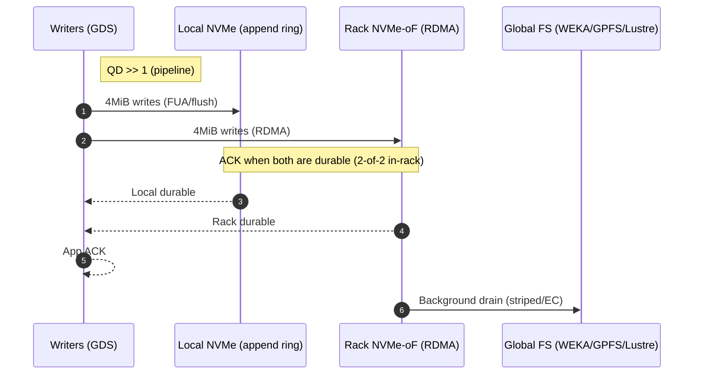
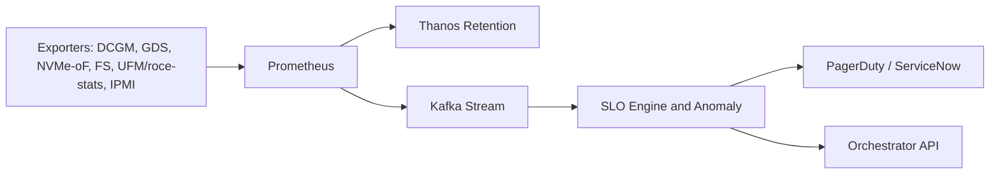
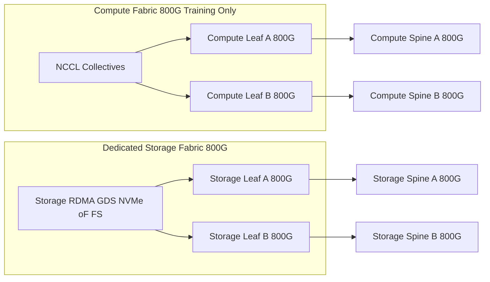
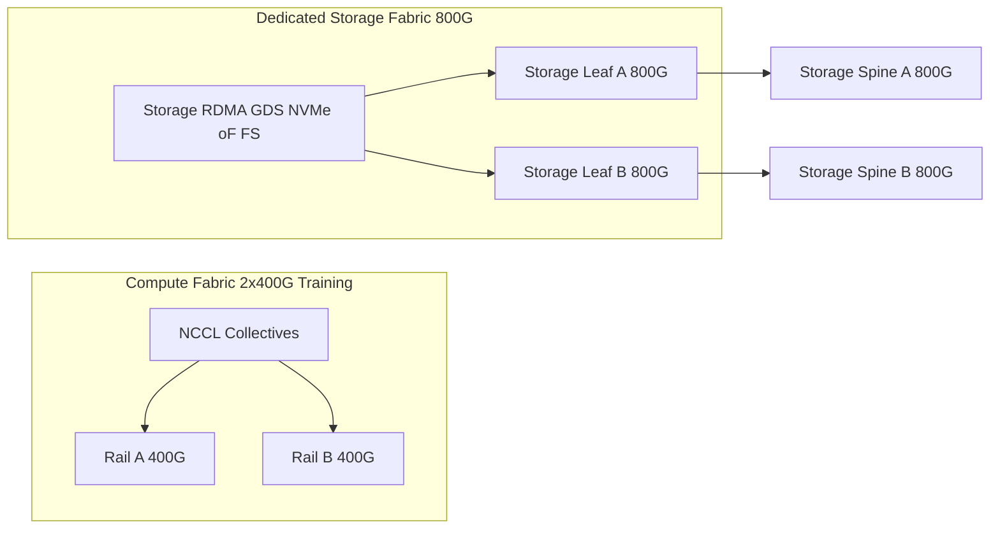

# Starcluster GB300 / NVL72 — Storage Deliverable (50 MW)

This document delivers Option 1 (Checkpoint SLOs & Capacity Model) and Option 2 (Storage Acceptance Test Plan) as requested. Sections 3 and 4 are bonus architecture: Section 3 aligns to the current dual 400 G shared-rail site plan; Section 4 proposes the best-possible variant with separate 800 G storage rails.

## Table of Contents

- [Starcluster GB300 / NVL72 — Storage Deliverable (50 MW)](#starcluster-gb300--nvl72--storage-deliverable-50-mw)
  - [Table of Contents](#table-of-contents)
  - [Option 1 — Checkpoint SLOs \& Capacity Model](#option-1--checkpoint-slos--capacity-model)
    - [1.1 Site \& Rack Baseline (from plan)](#11-site--rack-baseline-from-plan)
    - [1.2 SLOs (Targets)](#12-slos-targets)
    - [1.3 Capacity Model (Simple, Rack-Driven)](#13-capacity-model-simple-rack-driven)
  - [Option 2 — Storage Acceptance Test Plan (RFS Gate)](#option-2--storage-acceptance-test-plan-rfs-gate)
    - [2.1 Principles](#21-principles)
    - [2.2 Tooling](#22-tooling)
    - [2.3 RFS-Gate Test Matrix](#23-rfs-gate-test-matrix)
    - [2.4 Gate \& rollout](#24-gate--rollout)
  - [Architecture (Shared Rails) — Inference \& Training, Flows, Telemetry, Fault Domains](#architecture-shared-rails--inference--training-flows-telemetry-fault-domains)
    - [3.1 Rail Sharing (QoS View)](#31-rail-sharing-qos-view)
    - [3.2 Inference (Latency-First)](#32-inference-latency-first)
    - [3.3 Training (Throughput-First)](#33-training-throughput-first)
    - [3.4 Telemetry \& Alarming (implements Option 2 gates)](#34-telemetry--alarming-implements-option-2-gates)
    - [3.5 Failure Domains \& Guardrails](#35-failure-domains--guardrails)
  - [Bonus: "THE BEST" — Separate 800 G Storage Rails (Recommendation)](#bonus-the-best--separate-800-g-storage-rails-recommendation)
    - [4.1 What we actually recommend for "THE BEST"](#41-what-we-actually-recommend-for-the-best)
    - [4.2 Revised SLOs (BEST-Full800)](#42-revised-slos-best-full800)
    - [4.3 Architecture diagrams](#43-architecture-diagrams)
    - [4.4 Back-end mapping \& migration](#44-back-end-mapping--migration)
    - [4.5 Quick comparison](#45-quick-comparison)
  - [Acronyms (Expanded, Alphabetized)](#acronyms-expanded-alphabetized)

## Option 1 — Checkpoint SLOs & Capacity Model

### 1.1 Site & Rack Baseline (from plan)

**Power Target:** 50 MW IT load.

**Racks:** 9 zones × 32 racks = 288 racks.

**Per-rack links:** 2 × 400 G rails (aggregate ≈ 100 GB/s).

**Fabric:** RoCEv2 on both rails; storage/IP share the rails under lower-priority QoS; separate mgmt L3.

**Switching:** 400 G leaf/spine design (e.g., TH5-class).

**Ops:** intent-based rollouts via Kubernetes operators.

### 1.2 SLOs (Targets)

**Checkpoint commit (per rack / shared rails):**
- Write throughput offered: ≥ 68–80 GB/s into Local + Rack (see §3), sized below the 100 GB/s rack ceiling.
- Latency: P99 4 MiB write ≤ 0.8 ms (GDS + RDMA).
- Durability: 2-of-2 in-rack (Local NVMe and Rack NVMe-oF) before ACK.

**Dataset reads (per rack):** ≥ 100 GB/s aggregate (Local + Rack + Global), P99 1 MiB ≤ 1.5 ms via GDS.

**Inference I/O (per cell):** P99 1 MiB read ≤ 1.0 ms via GDS; end-to-end L4 P99 < 10 ms per request (excluding token generation).

### 1.3 Capacity Model (Simple, Rack-Driven)

Let:
- R = racks (≤ 288)
- S_TB = checkpoint size per rack (TB)
- T_sec = commit target (s)
- D_min = drain window (min)

**Per-rack hot-commit (GB/s):**
```
GBps_per_rack = 1024 * S_TB / T_sec
```

**Cluster drain (GB/s):**
```
GBps_cluster = (1024 * S_TB * R) / (60 * D_min)
```

**TB/min cluster:**
```
TB_per_min = (GBps_cluster / 1024) * 60
```

**Illustrative sizing (fits the rails & QoS):**

| Parameter | Value |
|-----------|--------|
| Racks (R) | 288 |
| Checkpoint per rack (S_TB) | 8 TB |
| Commit target (T_sec) | 120 s |
| Drain window (D_min) | 10 min |

**Computed:**
- **Per-rack hot-commit:** 1024×8/120 ≈ 68.3 GB/s (≤ 100 GB/s budget ✔)
- **Cluster drain:** (1024×8×288)/(60×10) ≈ 3,931 GB/s (≈ 3.84 TB/s)
- **TB/min cluster:** (3,931/1024)×60 ≈ 230 TB/min

If S_TB or T_sec change, recalc with the same formulas. If commit exceeds the 100 GB/s rack budget, stagger commits or adopt separate storage rails (see §4).

## Option 2 — Storage Acceptance Test Plan (RFS Gate)

### 2.1 Principles

- Vendor-neutral tooling & procedures.
- Pass/fail tied directly to Option 1 SLOs.
- Covers normal, burst/cache soak, and degraded modes with failure injection.

### 2.2 Tooling

**fio** (NVMe & NVMe-oF RDMA), **IOR / MLPerf-Storage** (checkpoint profiles), **ib_write_bw / ib_read_lat** (rail sanity), **nccl-tests** (collectives), **Triton dry-load** (inference I/O latency), **telemetry exporters** (cuFile/GDS, NVMe, FS, UFM/roce-stats), **Prometheus/Thanos/Kafka/Loki**, **API load** (k6/wrk) for N-S ingress.

### 2.3 RFS-Gate Test Matrix

| Test | Purpose | Procedure | Pass / Fail |
|------|---------|-----------|-------------|
| Rail sanity | Validate 2×400 G rails | ib_write_bw (4 MiB), multi-rail; watch ECN/PAUSE | ≥ 90% of theoretical; no ECN storms |
| QoS isolation | Training wins vs storage | Run NCCL ring/all-reduce + concurrent fio writes; storage class lower priority | NCCL bw stable (±5%); storage rate-limited without loss |
| Checkpoint hot-commit | Meet per-rack write SLO | Parallel 4 MiB writes (QD ≫ 1) to Local + Rack via GDS for 30 min | ≥ 68 GB/s (example above); P99 4 MiB ≤ 0.8 ms; ACKs show 2-of-2 durable |
| Burst/cache soak | Verify drain window | Fill Local + Rack to S_TB; drain to FS; rails shared | Clears in D_min with no NCCL regression |
| Degraded SSD | Device failure | Mark 1 NVMe degraded; rerun hot-commit | ≥ 70% throughput, P99 ≤ 2× target; reweight to Rack/FS observed |
| NVMe-oF path loss | Link/target failover | Drop one path/port; run 1 MiB & 4 MiB fio | No I/O errors; multipath swaps < 2 s; rail util ≥ 80% |
| FS parallel I/O | E2E drain capacity | IOR / MLPerf-Storage to WEKA/GPFS/Lustre | Hit GBps_cluster (Option 1) for ≥ 30 min |
| Inference I/O probe | Sub-ms reads | Triton dry-load; 1 MiB via GDS from Local/Rack | P99 ≤ 1.0 ms (I/O); E2E P99 < 10 ms excl. generation |

### 2.4 Gate & rollout

**RFS:** all tests PASS at zone scale (e.g., 32 racks) before scaling to 288.

**Release CI/CD:** reduced suite (rail sanity, NVMe-oF fio, Triton probe) per cell; block rollout on regressions.

**Degraded mode:** any single failure keeps ≥ 70% throughput and ≤ 2× P99.

## Architecture (Shared Rails) — Inference & Training, Flows, Telemetry, Fault Domains

Implements the SLOs and test plan on the current site plan: storage shares the same 2×400 G rails with training (lower-priority QoS).

### 3.1 Rail Sharing (QoS View)

```mermaid
flowchart LR
  subgraph RACK [Rack: Dual 400G Rails (Shared)]
    TRAIN[Training RDMA (High Priority, Lossless)]
    STOR[Storage + IP (Lower Priority QoS)]
  end
  TRAIN -- RoCEv2 --> RailA[Rail-A 400G]
  TRAIN -- RoCEv2 --> RailB[Rail-B 400G]
  STOR -- RoCEv2 --> RailA
  STOR -- RoCEv2 --> RailB
```

- Training traffic runs in a higher-priority lossless class.
- Storage/IP ride lower-priority classes and back off during contention; checkpoint lands Local + Rack then drains (Option 2 tests cover this).

### 3.2 Inference (Latency-First)


### 3.3 Training (Throughput-First)



### 3.4 Telemetry & Alarming (implements Option 2 gates)



### 3.5 Failure Domains & Guardrails


**Guardrails**

- Quarantine budget ≤ 10% trays per rack.
- Act only on consecutive SLO breaches (no flapping).
- Compute vs storage priorities enforced via QoS; management plane isolated.

## Bonus: "THE BEST" — Separate 800 G Storage Rails (Recommendation)

Two variants (pick per optics/availability):

### 4.1 What we actually recommend for "THE BEST"

**1. BEST-Full800 — Compute 800 G + Storage 800 G** (max headroom, cleanest isolation)
- **Compute (training/NCCL):** 1–2× **800 G** per tray on a dedicated compute fabric (IB XDR 800 G preferred; Spectrum-X 800 G if Ethernet).
- **Storage:** 1–2× **800 G** per tray on a dedicated storage fabric.
- **Why:** Removes contention *and* lifts NCCL ceiling; simplest performance story.

**2. BEST-Storage800 — Compute stays 2×400 G; Storage 800 G** (lower change blast radius)
- Keep existing training rails and add 800 G storage rails to eliminate storage contention now.
- Upgrade compute rails later if/when optics, power, or scheduling allow.

**Practical notes (GB300 trays):**
- GB300 trays expose multiple **ConnectX-8 SuperNIC** ports; you can assign **800 G** ports to compute and storage independently (multi-rail on both).
- If you must keep Ethernet on compute, **Spectrum-X 800 G** works; otherwise **Quantum-X800 IB** is the cleanest for NCCL.

### 4.2 Revised SLOs (BEST-Full800)

**Training (compute rails 800 G):** improved NCCL bw/latency, better multi-rail scaling; fewer QoS interventions.

**Per-rack checkpoint commit (storage rails 800 G):**
- **1×800 G storage port per tray:** **≥ 120 GB/s**
- **2×800 G storage ports per tray:** **≥ 200 GB/s**
- **P99 4 MiB ≤ 0.8 ms** (GDS/RDMA)

**Dataset reads (storage rails 800 G):** **≥ 120–200 GB/s**, independent of training load.

**Cluster drains:** linear with number of racks × per-rack storage SLO (e.g., 288 × 200 GB/s ≈ **57.6 TB/s** ingress).

### 4.3 Architecture diagrams

**BEST-Full800 (Compute 800 G + Storage 800 G):**



**BEST-Storage800 (transitional - Storage-only 800 G):**



### 4.4 Back-end mapping & migration

- **Latency cell(s):** WEKA on storage rails.
- **Drain/namespace cell(s):** GPFS (ECE) or Lustre on storage rails.
- **N-S multiprotocol:** VAST on services network.
- **Migration:** rack-by-rack—cable 1×800 G storage port, enable multi-rail; then add the 2nd 800 G port to reach ~200 GB/s per rack.

### 4.5 Quick comparison

| Design | Training Rails | Storage Rails | Per-rack storage SLO (write) | P99 (4 MiB) | Contention |
|--------|----------------|---------------|------------------------------|-------------|------------|
| Current plan (shared) | 2×400 G | Shared on same rails (lower QoS) | ≥ 68–80 GB/s | ≤ 0.8 ms | Yes (QoS mitigates) |
| BEST-Storage800 | 2×400 G | 1×800 G dedicated | ≥ 120 GB/s | ≤ 0.8 ms | Storage: No, Compute: Existing |
| BEST-Full800 | 1-2×800 G | 1-2×800 G dedicated | ≥ 120–200 GB/s | ≤ 0.8 ms | No |

**One-liner for the deck:**
"In the BEST design we dedicate **800 G** to **both** compute and storage fabrics. That removes contention, raises the NCCL ceiling, and guarantees **≥ 120–200 GB/s** per rack to storage with **sub-ms P99**—or, as a transitional step, we can keep compute at **2×400 G** and still get the storage benefits by adding **800 G** storage rails."

## Acronyms (Expanded, Alphabetized)

* **ACK** — Acknowledgement (here: app success after durable writes complete)
* **AR** — Adaptive Routing (InfiniBand)
* **BF3** — BlueField-3 DPU (SmartNIC with offloads)
* **CI/CD** — Continuous Integration / Continuous Delivery
* **CNI** — Container Network Interface (Kubernetes networking)
* **DCGM** — Data Center GPU Manager (NVIDIA GPU health/telemetry)
* **DPDK** — Data Plane Development Kit (user-space I/O)
* **DPU** — Data Processing Unit (SmartNIC)
* **EC** — Erasure Coding (e.g., 8+2)
* **ECMP** — Equal-Cost Multi-Path (Ethernet multipath)
* **ECN** — Explicit Congestion Notification (RoCE congestion mark)
* **E2E** — End-to-End
* **FS** — Filesystem (WEKA, GPFS, Lustre, VAST, etc.)
* **FUA** — Force Unit Access (NVMe "persist before complete")
* **GDS** — GPUDirect Storage (direct SSD↔GPU DMA)
* **HBM** — High-Bandwidth Memory (on GPU)
* **HCA** — Host Channel Adapter (InfiniBand NIC)
* **IB** — InfiniBand (HPC fabric; NDR=400 G, XDR=800 G)
* **IOR** — HPC I/O benchmark (part of IOR suite)
* **IPMI** — Intelligent Platform Management Interface (BMC telemetry)
* **JBOF** — Just a Bunch Of Flash (NVMe enclosure)
* **KEDA** — Kubernetes Event-Driven Autoscaling
* **KV (cache)** — Key-Value cache (per-request context)
* **L4/L7** — Layer-4/Layer-7 networking
* **LAG** — Link Aggregation Group (avoid for RDMA data paths)
* **LNet** — Lustre Networking stack
* **MLPerf-Storage** — MLPerf storage I/O workload (e.g., checkpoint profile)
* **NCCL** — NVIDIA Collective Communications Library (multi-GPU collectives)
* **NDR/XDR** — InfiniBand gens (NDR=400 Gb/s, XDR=800 Gb/s per port)
* **NFD** — Node Feature Discovery (Kubernetes)
* **NIC** — Network Interface Card
* **N-S / E-W** — North-South (ingress/egress) / East-West (intra-DC)
* **NVLink** — NVIDIA GPU interconnect (within NVL72 domain)
* **NVMe / NVMe-oF** — Non-Volatile Memory express / NVMe over Fabrics
* **PLP** — Power-Loss Protection (SSD capacitors)
* **P99** — 99th-percentile latency (tail)
* **QP / QD** — Queue Pair / Queue Depth (RDMA)
* **QoS** — Quality of Service (priority/shaping)
* **RAG** — Retrieval-Augmented Generation
* **RDMA** — Remote Direct Memory Access (zero-copy I/O)
* **RFS** — Ready-For-Service (gate: pre-prod acceptance)
* **RoCE** — RDMA over Converged Ethernet
* **SHARP** — Switch-accelerated reduction (InfiniBand)
* **SLA / SLO** — Service Level Agreement / Objective
* **SMB / NFS / S3** — File/Object protocols (Server Message Block, Network File System, Simple Storage Service)
* **SPDK** — Storage Performance Development Kit (user-space NVMe/NVMe-oF)
* **SR-IOV** — Single-Root I/O Virtualization
* **TCP** — Transmission Control Protocol
* **ToR** — Top-of-Rack switch
* **TTL** — Time-To-Live (cache expiration)
* **UFM** — Unified Fabric Manager (IB fabric telemetry)
* **Vector DB** — Vector database (embeddings/ANN index)
* **WEKA** — WekaFS (user-space, RDMA-optimized parallel FS)
* **ZFS** — Zettabyte File System
* **ZNS** — Zoned Namespace (append-friendly SSD mode)