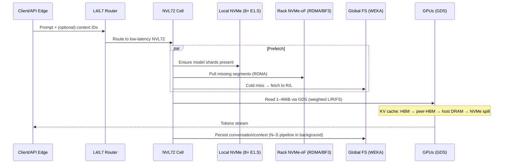
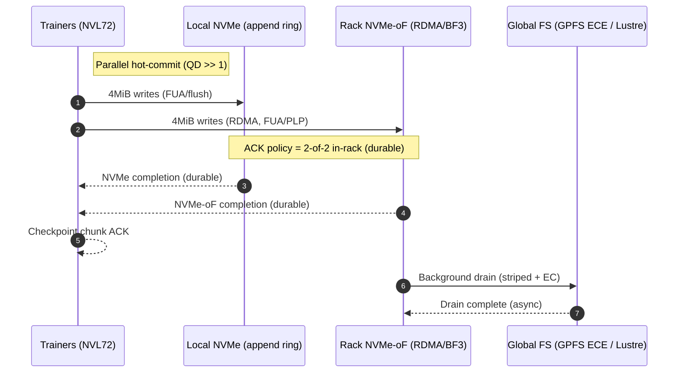
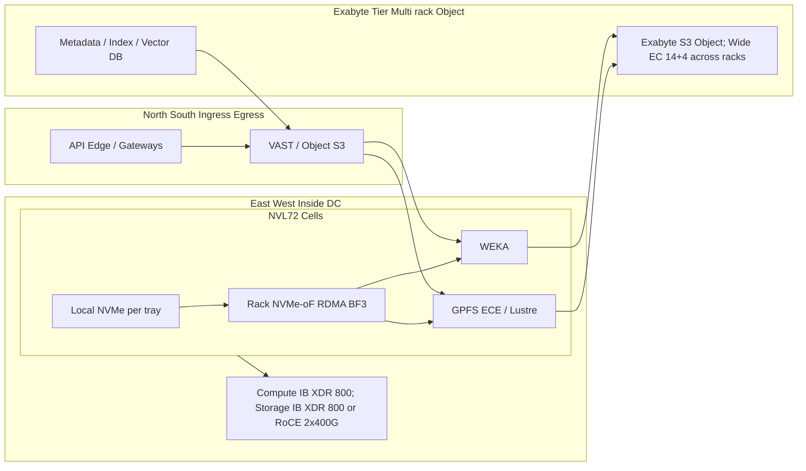
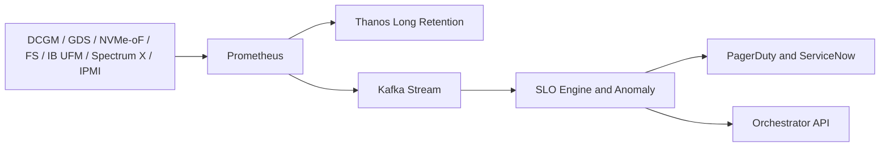
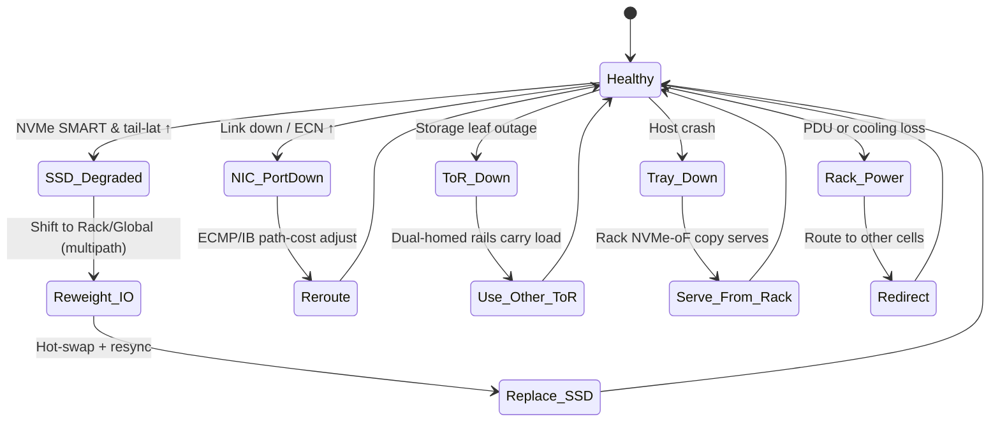

# Starcluster GB300 / NVL72 Storage Architecture

**Massive Training & Massive Inference — Two Focused Designs, One Cohesive Platform**

## Table of Contents

- [Starcluster GB300 / NVL72 Storage Architecture](#starcluster-gb300--nvl72-storage-architecture)
  - [Table of Contents](#table-of-contents)
  - [1. Executive Objectives \& SLOs](#1-executive-objectives--slos)
    - [SLOs (targets):](#slos-targets)
  - [2. Architecture A — Inference‑First (Latency Champion)](#2-architecture-a--inferencefirst-latency-champion)
    - [A1. What we optimize](#a1-what-we-optimize)
    - [A2. Components](#a2-components)
    - [A3. Inference Data Path (Client → GPU)](#a3-inference-data-path-client--gpu)
    - [A4. Why it wins](#a4-why-it-wins)
  - [3. Architecture B — Training‑First (Throughput Champion)](#3-architecture-b--trainingfirst-throughput-champion)
    - [B1. What we optimize](#b1-what-we-optimize)
    - [B2. Components](#b2-components)
    - [B3. Training Checkpoint Commit (Write Path)](#b3-training-checkpoint-commit-write-path)
    - [B4. Why it wins](#b4-why-it-wins)
  - [4. North–South vs East–West Data Flows (with Exabyte Tier)](#4-northsouth-vs-eastwest-data-flows-with-exabyte-tier)
    - [4.1 Storage Architecture Overview](#41-storage-architecture-overview)
    - [Design notes](#design-notes)
  - [5. Proposed Telemetry, SLO Alarming \& CI/CD Gates](#5-proposed-telemetry-slo-alarming--cicd-gates)
    - [5.1 What we measure](#51-what-we-measure)
    - [5.2 Telemetry \& Alarming Pipeline](#52-telemetry--alarming-pipeline)
  - [6. Failure Domains \& Blast-Radius Control](#6-failure-domains--blast-radius-control)
    - [Guardrails](#guardrails)
  - [7. Automated Failure Handling / Break‑Fix Automation](#7-automated-failure-handling--breakfix-automation)
    - [Control loop (always‑on):](#control-loop-alwayson)
  - [8. RDMA Local Storage Strategy \& Off‑Rack Arrays](#8-rdma-local-storage-strategy--offrack-arrays)
    - [Recommended "RDMA local" design:](#recommended-rdma-local-design)
    - [Off‑rack arrays:](#offrack-arrays)
  - [9. Vendor Reference (Why Each, Where It Fits)](#9-vendor-reference-why-each-where-it-fits)
  - [10. Acronyms](#10-acronyms)

## 1. Executive Objectives & SLOs

**Goal:** "Absolute best" GB300/NVL72 design to (a) hit sub‑ms P99 on the hot path for inference and (b) sustain line‑rate on all storage rails even during failures for training and inference, at 10 GW scale.

**Hardware baseline (per tray):** 4× ConnectX‑8 SuperNICs (800 G/port; IB XDR or 2×400 GbE RoCE mode), up to 8× E1.S NVMe (Gen5 today; Gen6 as it matures). One NVL72 cell = 72 GPUs (single NVLink domain).

### SLOs (targets):

- **Inference I/O:** 1 MiB read P99 ≤ 1.0 ms via GDS (local or rack NVMe‑oF); end‑to‑end L4 (network+I/O+decode, excl. token gen) P99 < 10 ms per request per cell.
- **Training dataset read (per tray):** ≥ 100–160 GB/s aggregate across both storage rails (Local + Rack + Global), P99 1 MiB ≤ 1.5 ms.
- **Checkpoint commit (per tray):** ≥ 200 GB/s write offered (2× ~100 GB/s rails) with P99 4 MiB ≤ 0.8 ms on Local+Rack path; 2‑of‑2 in‑rack durable ACK.

## 2. Architecture A — Inference‑First (Latency Champion)

### A1. What we optimize

- Sub‑ms P99 for MiB‑scale reads/writes into GPUs.
- Hot weights + context locality inside the selected NVL72 cell.
- Rapid model (re)loads and KV cache efficiency.

### A2. Components

- **Compute fabric (E–W):** InfiniBand XDR 800 G (multi‑rail).
- **Storage fabric (E–W):** IB XDR 800 G or RoCE 2×400 G/port per SuperNIC, multi‑rail (no LAG).
- **Local NVMe (per tray):** 8× E1.S as an append‑only ring (SPDK or XFS/ext4 O_DIRECT + io_uring).
- **Rack NVMe‑oF target:** SPDK over RDMA, ideally BF3 DPU‑offloaded.
- **Global FS (low latency):** WEKA (user‑space dataplane) for POSIX+S3; GDS everywhere.

### A3. Inference Data Path (Client → GPU)

### A4. Why it wins

- GDS + RDMA avoid page cache/bounce copies → sub‑ms P99.
- Local NVMe is the latency shield; rack NVMe‑oF supplies extra bandwidth and a second durable in‑rack copy; WEKA gives lowest POSIX latency when global needed.
- KV cache uses paged attention (HBM‑centric; spill to DRAM/NVMe), improving utilization at scale.

## 3. Architecture B — Training‑First (Throughput Champion)

### B1. What we optimize

- Multi‑TB/s per rack sustained bandwidth for dataset ingest and checkpoint drains.
- Line‑rate during failures via parallel hot‑commit and reweighting.

### B2. Components

- **Compute fabric (E–W):** InfiniBand XDR 800 G.
- **Storage fabric (E–W):** IB XDR 800 G or RoCE 2×400 G/port per NIC, multi‑rail.
- **Local NVMe (per tray):** hot‑commit append ring.
- **Rack NVMe‑oF target:** SPDK over RDMA (BF3 offload preferred).
- **Global FS (throughput):** GPFS (ECE) or Lustre for parallel striping + declustered EC. GDS for GPU‑direct writes/reads.

### B3. Training Checkpoint Commit (Write Path)

### B4. Why it wins

- Local + Rack parallel hot‑commit → two in‑rack copies before ACK.
- Reweighting across Local/Rack/Global keeps both storage rails full even when an SSD slows/fails.
- GPFS/Lustre provide TB/s drains and fast rebuild (ECE/EC pools).

## 4. North–South vs East–West Data Flows (with Exabyte Tier)

### 4.1 Storage Architecture Overview

### Design notes

- **N–S (long‑term):** VAST/Object holds conversations, datasets, analytics, compliance copies; exabyte scale via wide‑EC across many racks/rooms + geo‑replication.
- **E–W (hot):** Local + Rack NVMe‑oF deliver sub‑ms; WEKA/GPFS/Lustre provide parallel bandwidth and namespace.
- **RAG/Context:** Vector DB/Index (N–S) feeds context to inference cells; cells prefetch into Rack/Local before execution.

## 5. Proposed Telemetry, SLO Alarming & CI/CD Gates

### 5.1 What we measure

- **GDS/cuFile:** direct‑path hit‑rate; op latency histograms.
- **NVMe / NVMe‑oF:** QD, tail latency, ANA state; SMART.
- **FS clients (WEKA/GPFS/Lustre):** client P50/P99, lock/metadata wait, per‑interface throughput.
- **Fabric:** IB credit stalls/AR; RoCE ECN marks, retrans, queue depths.
- **Health:** DCGM (GPU), NVLink errors; IPMI/Redfish (fans/PSUs/temps).

### 5.2 Telemetry & Alarming Pipeline

**CI/CD "golden tests" (per cell, per release):**
IOR/MLPerf‑Storage checkpoint profile; ib_write_bw; NCCL microbench; NVMe‑oF fio (RDMA); Triton dry‑load latency gate.

## 6. Failure Domains & Blast-Radius Control

### Guardrails

- **Quarantine budget:** ≤ 10% trays per rack at once.
- **Consecutive SLO breach** before action (avoid flapping).
- **Compute vs Storage fabrics** isolated to prevent cross‑impact.

## 7. Automated Failure Handling / Break‑Fix Automation

### Control loop (always‑on):

1. Detect SLO/health anomalies (Section 5).
2. Mitigate immediately (reweight Local/Rack/Global; re‑route ECMP/IB).
3. Quarantine node only after sustained breach; rate‑limiting by fault domain.
4. Dispatch work order via API (part list + location).
5. Rebuild & rejoin into pool; CI checks before traffic.

## 8. RDMA Local Storage Strategy & Off‑Rack Arrays

### Recommended "RDMA local" design:

- **Node‑local NVMe (8× E1.S)** = append ring + warm weights (latency shield).
- **Rack NVMe‑oF (SPDK over RDMA)**, BF3 offload preferred, dual‑homed to storage leafs; sized to add ≥ 100–150 GB/s per tray under load.
- **ACK policy:** 2‑of‑2 in‑rack durable (Local + Rack) with high QD so rails are never idle.

### Off‑rack arrays:

- Not in the hot path (latency & blast‑radius).
- Useful behind the global tier (capacity/object, archive, compliance), not for first‑commit or hot reads.

## 9. Vendor Reference (Why Each, Where It Fits)

| Layer | Primary Choice | Why | Best For | Alternatives |
|-------|---------------|-----|----------|-------------|
| Rack NVMe‑oF target (RDMA) | SPDK on BF3 DPU | Lowest tail; frees host cores; deterministic | Second in‑rack copy, steady 200 GB/s/tray | SPDK on x86 host (when DPU NA) |
| Global FS (low‑latency E–W) | WEKA | User‑space dataplane + distributed metadata → lowest POSIX P99 | Inference & mixed small I/O | — |
| Global FS (drains/namespace) | IBM Storage Scale (GPFS, ECE) | TB/s drains; declustered EC; global namespace | Checkpoints; policy tiering | Lustre (open, extreme sequential BW) |
| N–S / multiprotocol | VAST | NFS/SMB/S3; wide‑EC capacity; simple ops | Ingress/egress, analytics, data prep | — |
| Alt FS (optional) | BeeGFS | Open w/ commercial support; good metadata scaling; RDMA+GDS | Cost‑balanced clusters | Less proven at extreme AI scale |
| Fabrics | Quantum‑X800 (IB) / Spectrum‑X (RoCE) | 800 G era; AI congestion control; multi‑rail | Compute & Storage E–W | — |
| Node‑local FS | SPDK / XFS/ext4 O_DIRECT | Lowest tail; simple rings | Hot commit; warm weights | ZFS (only if you need snapshots/quotas) |

## 10. Acronyms

**ACK** (acknowledgement), **AR** (adaptive routing), **BF3** (BlueField‑3 DPU), **EC** (erasure coding), **ECMP** (equal‑cost multi‑path), **ECN** (congestion mark), **FS** (filesystem), **FUA** (force unit access), **GDS** (GPUDirect Storage), **HBM** (GPU memory), **IB** (InfiniBand), **JBOF** (flash enclosure), **LAG** (link aggregation; avoid for RDMA), **NVMe‑oF** (NVMe over Fabrics), **PLP** (power‑loss protection), **QP/QD** (RDMA queue pair/depth), **RDMA** (remote direct memory access), **RoCE** (RDMA over Converged Ethernet), **SPDK** (Storage Performance Dev Kit), **ToR** (Top‑of‑Rack), **TTL** (time‑to‑live), **ZNS** (zoned namespace).
