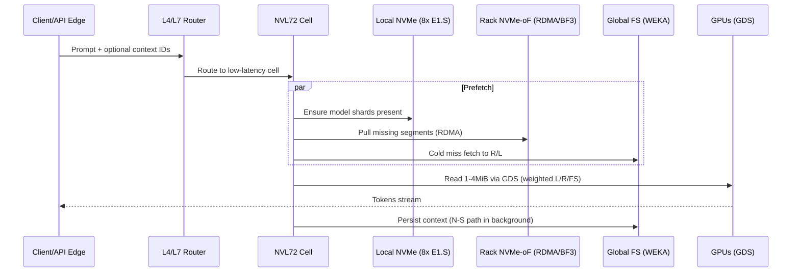
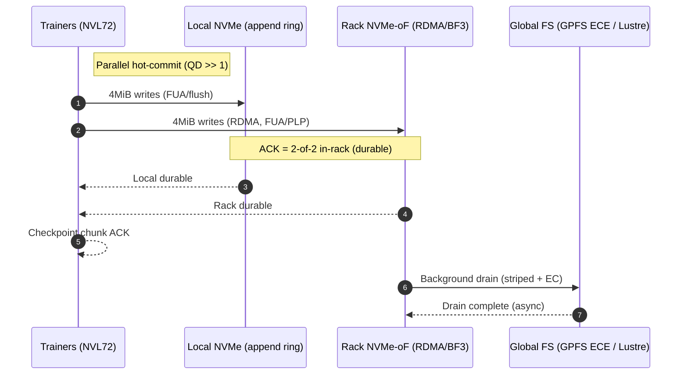
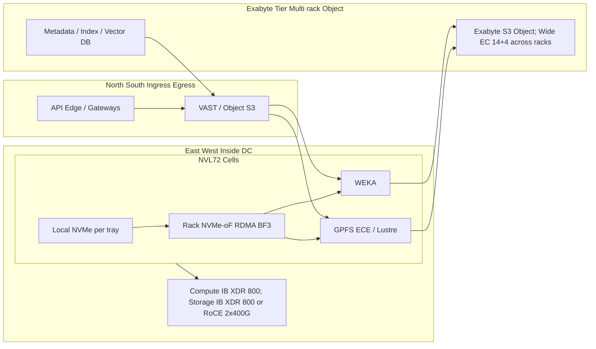
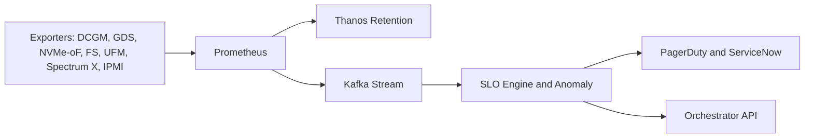

# Starcluster GB300 / NVL72 — Storage Deliverable

**50MW Deployment**

## Option 1 — Checkpoint SLOs & Capacity Model

### 1.1 Scope & Baseline

**Platform:** GB300 NVL72 (per rack = 72 GPUs, single NVLink domain).

**Per tray:** 4x ConnectX-8 SuperNICs (800G each) and up to 8x E1.S NVMe.

**Fabrics:** Compute (IB XDR 800G), Storage (IB XDR 800G or RoCE 2x400G/port).

**Hot path principle:** RDMA → GDS → GPU; first commit remains in-rack.

### 1.2 SLOs (Targets)

**Checkpoint commit (per tray):**
- Write throughput offered: ≥ 200 GB/s (2 storage rails x ~100 GB/s).
- Latency: P99 4 MiB write ≤ 0.8 ms on Local+Rack path.
- Durability: 2-of-2 in-rack durable before ACK (Local NVMe + Rack NVMe-oF).

**Dataset reads (per tray):**
- Throughput: ≥ 100–160 GB/s aggregate across Local + Rack + Global FS.
- Latency: P99 1 MiB read ≤ 1.5 ms via GDS.

**Inference I/O (per cell):**
- Latency: P99 1 MiB read ≤ 1.0 ms (GDS from Local/Rack).
- End-to-end L4: P99 < 10 ms per request (excluding token generation).

### 1.3 Capacity Model (Simple, Rack-Driven)

**Formulas**

Per-rack hot-commit bandwidth (GB/s):
```
GBps_per_rack = 1024 * checkpoint_TB_per_rack / seconds_to_commit
```

Cluster drain requirement (GB/s):
```
GBps_cluster = (1024 * checkpoint_TB_per_rack * racks) / (60 * drain_minutes)
```

TB/min cluster (reporting):
```
TB_per_min = (GBps_cluster / 1024) * 60
```

**Example Table (illustrative)**

| Parameter | Value |
|-----------|--------|
| Checkpoint size per rack (TB) | 12 |
| Commit interval (sec) | 60 |
| Racks | 50 / 100 / 200 |
| Drain window (min) | 10 |

**Computed**

Per-rack hot-commit: `GBps_per_rack = 1024*12/60 = 204.8 GB/s`

Cluster drain: `GBps_cluster = (1024*12*racks)/(60*10) = 20.48 * racks GB/s`

TB/min cluster: `TB_per_min = (GBps_cluster / 1024) * 60 = 1.2 * racks TB/min`

| Racks | Per-rack Commit (GB/s) | Cluster Drain (GB/s) | Cluster TB/min |
|-------|------------------------|----------------------|----------------|
| 50    | 204.8                  | 1,024               | 60             |
| 100   | 204.8                  | 2,048               | 120            |
| 200   | 204.8                  | 4,096               | 240            |

**Interpretation:** With a 12 TB/rack checkpoint every 60s, each rack must commit ~205 GB/s. A 100-rack site must drain ~2 TB/s to empty in 10 minutes (120 TB/min).

## Option 2 — Storage Acceptance Test Plan (RFS Gate)

### 2.1 Principles

- Vendor-neutral tooling, reproducible procedures.
- Pass/fail thresholds tied to SLOs above.
- Covers normal, burst, and degraded modes with failure injection.

### 2.2 Tooling

**fio** (NVMe and NVMe-oF RDMA), **IOR / MLPerf-Storage** (checkpoint profiles), **ib_write_bw / ib_read_lat** (fabric), **nccl-tests** (collectives sanity), **Triton dry-load** (inference latency probe), **DCGM/GDS/FS exporters** (telemetry).

### 2.3 Test Matrix (excerpt)

| Test | Purpose | Procedure | Pass/Fail |
|------|---------|-----------|-----------|
| Checkpoint Hot-Commit Soak | Validate write SLO & ACK policy | On N trays per rack, write 4 MiB records at QD>>1 to Local + Rack NVMe-oF in parallel for T=30 min; capture P50/P99 and ACK path | PASS if P99 ≤ 0.8 ms, rails ≥ 200 GB/s/tray offered, ACKs show 2-of-2 durable |
| Burst/Cache Soak | Validate buffers and drain | Fill Local + Rack to S TB/rack, then drain to Global FS | PASS if drain clears within D minutes and no GPU stalls |
| Degraded Device | SSD fails or GC spike | Mark 1 SSD degraded; repeat hot-commit test | PASS if ≥ 70% throughput sustained and P99 within 2x of target; reweight to Rack/Global observed |
| NVMe-oF Path Loss | Rack target path down | Disable one NVMe-oF port; run fio 1 MiB/4 MiB | PASS if no I/O errors; multipath rebalances within seconds; rail utilization ≥ 80% |
| Fabric Bandwidth | Link sanity | ib_write_bw 4 MiB multi-rail; compare to spec | PASS if ≥ 90% of theoretical; no credit stalls/ECN storms |
| FS Parallel I/O | Global drain capacity | IOR (POSIX) or MLPerf-Storage to Global FS at site scale | PASS if GB/s_cluster (from Option 1) achieved for 30 min |
| Inference Probe | P99 guard | Triton dry-load; 1 MiB reads via GDS | PASS if P99 < 1.0 ms (I/O) and E2E L4 P99 < 10 ms |

### 2.4 Gate & Rollout

**Pre-RFS:** All tests PASS at rack and site scope.

**Release CI/CD:** Run a reduced suite (fabric + NVMe-oF + Triton probe) per cell; block rollout on regressions.

**Degraded Mode:** Any single failure must keep ≥ 70% throughput and ≤ 2x P99.

## Section 3 — Bonus: Proposed Architectures, Flows, Telemetry, Fault Domains

The following implements the SLOs and the test plan above.

### 3.1 Inference-First (Latency Champion)

**Key:** sub-ms P99, hot weights/context in the chosen cell, GDS everywhere.



### 3.2 Training-First (Throughput Champion)

**Key:** TB/s drains, parallel hot-commit with in-rack durability.



### 3.3 North–South vs East–West (with Exabyte Tier)



**Notes:**

**N-S (long term):** VAST/Object for conversations, datasets, analytics, compliance; exabyte via wide EC + geo.

**E-W (hot):** Local + Rack NVMe-oF supply latency; WEKA/GPFS/Lustre provide bandwidth and namespace.

**Context/RAG:** Vector index in N-S; cells prefetch into Rack/Local.

### 3.4 Telemetry & Alarming (implements Option 2 gates)



**Golden tests in CI/CD:** IOR/MLPerf-Storage, ib_write_bw, nccl-tests, fio NVMe-oF (RDMA), Triton dry-load.

### 3.5 Failure Domains & Guardrails


**Guardrails**

- Quarantine budget ≤ 10% trays per rack.
- Actions only on consecutive SLO breaches (no flapping).
- Compute vs Storage fabrics isolated.

### 3.6 RDMA "Local" Strategy & Off-Rack Arrays

**Node-local NVMe (8x E1.S):** append ring + warm weights (latency shield).

**Rack NVMe-oF (SPDK RDMA, BF3 offload):** second in-rack durable copy; sized to add ≥ 100–150 GB/s per tray.

**ACK policy:** 2-of-2 in-rack durable with high QD.

**Off-rack arrays:** not in hot path; use behind global tier (capacity/object/DR).

### 3.7 Vendor Fit (Quick Table)

| Layer | Primary | Why | Best For | Alt |
|-------|---------|-----|----------|-----|
| Rack NVMe-oF | SPDK on BF3 | Lowest tail, offloads host | Second in-rack copy | SPDK on host |
| Global FS (low-P99) | WEKA | User-space DP, dist. metadata | Inference/mixed I/O | — |
| Global FS (drains/ns) | GPFS ECE | TB/s drains, declustered EC | Checkpoints, namespace | Lustre |
| N-S / Multi-proto | VAST | NFS/SMB/S3, wide EC | Ingress/egress, analytics | — |
| Alt FS | BeeGFS | Open, good metadata | Cost-balanced clusters | Less proven at extreme AI scale |
| Fabrics | Quantum-X800 / Spectrum-X | 800G, multi-rail RDMA | E-W compute/storage | — |
| Node FS | SPDK / XFS O_DIRECT | Lowest tail | Hot commit, warm cache | ZFS (if features needed) |

### 3.8 Acronyms (expanded, alphabetized)

* **ACK** — Acknowledgement (here: application-level success after *durable* writes complete)
* **AR** — Adaptive Routing (InfiniBand feature to avoid hot paths)
* **BF3** — BlueField-3 DPU (NVIDIA data-processing unit / SmartNIC)
* **CNI** — Container Network Interface (Kubernetes networking plug-in model)
* **DCGM** — Data Center GPU Manager (NVIDIA GPU health/telemetry suite)
* **DPDK** — Data Plane Development Kit (user-space packet I/O library)
* **DPU** — Data Processing Unit (SmartNIC with offloads like NVMe-oF, IPsec, etc.)
* **DR** — Disaster Recovery (off-site replication / restore strategy)
* **EC** — Erasure Coding (redundant data layout, e.g., 8+2)
* **ECMP** — Equal-Cost Multi-Path (multi-path routing/load-balancing on Ethernet)
* **ECN** — Explicit Congestion Notification (marking used by RoCE congestion control)
* **E2E** — End-to-End (full request path, including network, I/O, decode)
* **FS** — Filesystem (parallel/distributed FS such as WEKA, GPFS, Lustre, VAST)
* **FUA** — Force Unit Access (NVMe flag to persist data before reporting completion)
* **GDS** — GPUDirect Storage (direct DMA path between storage and GPU memory)
* **HBM** — High-Bandwidth Memory (on-package memory on the GPU)
* **HCA** — Host Channel Adapter (InfiniBand NIC)
* **IB** — InfiniBand (lossless HPC fabric; XDR=800 Gb/s generation)
* **IOR** — Interleaved or Random (HPC I/O benchmark; part of IOR suite)
* **IPMI** — Intelligent Platform Management Interface (baseboard mgmt/telemetry)
* **JBOF** — Just a Bunch Of Flash (NVMe flash enclosure)
* **KEDA** — Kubernetes Event-Driven Autoscaling (scales on external metrics/queues)
* **KV (cache)** — Key-Value cache (per-request context memory for inference)
* **L4/L7** — Layer 4/Layer 7 (transport/application layers in networking)
* **LAG** — Link Aggregation Group (802.3ad; avoid for RDMA data paths)
* **LNet** — Lustre Networking stack (client/server transport for Lustre)
* **MLPerf-Storage** — MLPerf benchmark profile for storage I/O (e.g., checkpoint profile)
* **NCCL** — NVIDIA Collective Communications Library (collectives for multi-GPU training)
* **NDR/XDR** — IB speed gens: NDR=400 Gb/s, XDR=800 Gb/s per port
* **NFD** — Node Feature Discovery (Kubernetes node labeling of hardware features)
* **NIC** — Network Interface Card
* **N–S / E–W** — North–South (ingress/egress) / East–West (internal DC traffic)
* **NVLink** — NVIDIA high-speed GPU interconnect (within NVL72 domain)
* **NVMe** — Non-Volatile Memory Express (protocol for SSDs)
* **NVMe-oF** — NVMe over Fabrics (NVMe over RDMA/TCP to remote targets)
* **PLP** — Power-Loss Protection (SSD capacitors guaranteeing write persistence)
* **P99** — 99th-percentile latency (tail latency SLO)
* **QP / QD** — Queue Pair / Queue Depth (RDMA connection objects / outstanding I/O count)
* **RAG** — Retrieval-Augmented Generation (fetch context for inference)
* **RDMA** — Remote Direct Memory Access (zero-copy, kernel-bypass I/O over IB/RoCE)
* **RFS** — Ready-For-Service gate (pre-production acceptance)
* **RoCE** — RDMA over Converged Ethernet (RDMA on Ethernet with PFC/ECN)
* **SHARP** — Scalable Hierarchical Aggregation and Reduction Protocol (IB switch collective offload)
* **SLA / SLO** — Service Level Agreement / Objective (contracted target vs internal target)
* **SMB / NFS / S3** — Protocols: Server Message Block, Network File System, Simple Storage Service (object)
* **SPDK** — Storage Performance Development Kit (user-space NVMe/NVMe-oF stack)
* **SR-IOV** — Single-Root I/O Virtualization (expose NIC VFs to pods/VMs)
* **TCP** — Transmission Control Protocol
* **ToR** — Top-of-Rack switch
* **TTL** — Time-To-Live (cache expiration policy)
* **UFM** — Unified Fabric Manager (NVIDIA IB fabric manager/telemetry)
* **Vector DB** — Vector database (embeddings/ANN index for RAG)
* **WEKA** — WekaFS (user-space, RDMA-optimized parallel filesystem)
* **ZFS** — Zettabyte File System (checksum/snapshot-rich filesystem)
* **ZNS** — Zoned Namespace (SSD mode optimized for append patterns)